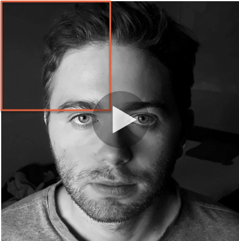
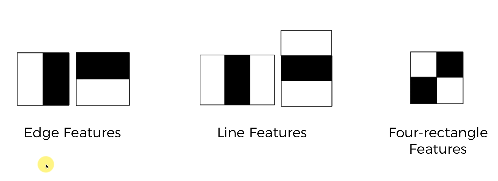
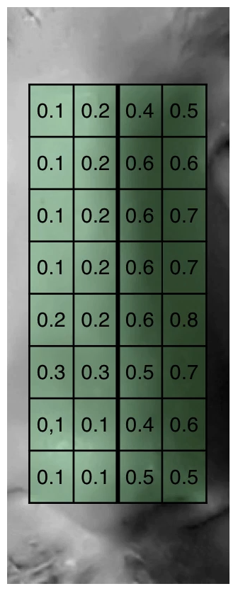
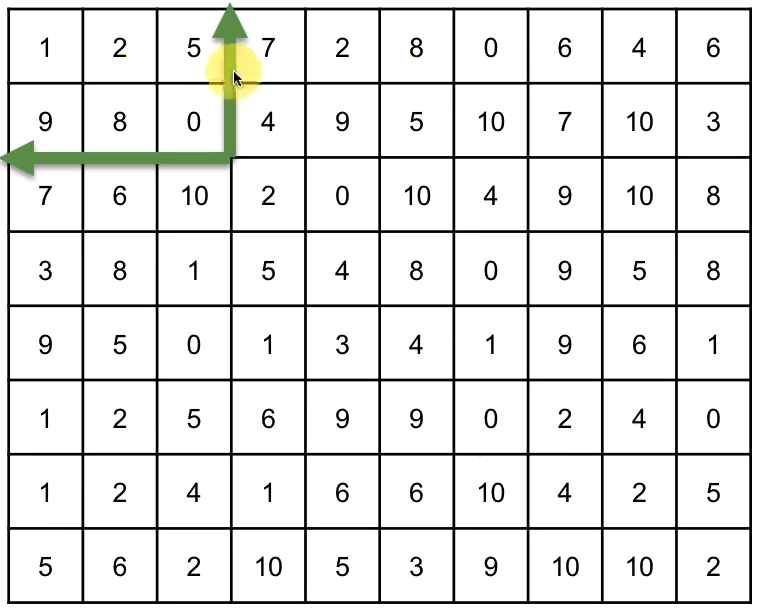

# Introduction
I wanna learn how to fuck with images in very cool ways. Will probably use it at work if i'm any good with it.

# Notes
## Viola-Jones Algorithm
The Viola-Jones is a super popular (and old!) algorithm and is still used heaps.

It has two stages;
1. Training
2. Detection

It may seem odd, but we'll start with detection to get a better idea of how this algorithm works.

### Training
The goal is to understand what features identify a face, and how to identify where it's meant to be present.

It first shrinks the image down to 24x24 pixels (as the Haar-like figure detection is scalable). This means that we have to do much fewer iterations in comparison to a 2000x2000 image. If we do find a feature, we simply scale up the features instead.

You need to supply a massive amount of images so that it can understand which of the features it is looking for are actually common.

**NOTE:** to quickly get a much larger library of images to train with, you can simply flip the image as an image and the same image flipped are completely different.

**NOTE:** to better train it, you need to supply images with absolutely none of these features (this should be a huge amount of images), these images don't need to be 24x24 but can instead be broken down into 24x24 subimages.

### Detection
NOTE: The Viola-Jones algorithm works best with frontal images.

The image is first turned into a greyscale version of the image as it can work more efficiently.

It first outlines a small quadrant and moves left-to-right to look for the face. It'll look for specific facial features like hair, eyebrows, eyes, nose, ears, mouth, etc. In the above image shown, in the orange quadrant we can see the eyebrow.

After it cycles the entire square, it'll move the square slightly to the right and continue searching. Once it moves all the way to the right edge and starts to slightly move down.

For this algorithm to confirm that what it's seeing in it's square of analysis, it needs to have two eyebrows, two eyes, a nose, and a mouth.

**NOTE:** the size of of the squares of analysis vary greatly in size as there can be small faces in the image, or a single face that takes up a large amount of space.

__Sources:__ [Rapid object detection using a boosted cascade of simple features (Paul Viola & Michael Jones, 2001)](http://citeseerx.ist.psu.edu/viewdoc/download?doi=10.1.1.10.6807&rep=rep1&type=pdf)

## Haar-like Features
This is based on the Haar wavelet which acts similarly to the Fourier transformation.

These features include;
1. Edge features
2. Line features
3. Four-rectangle features

**How do these work?**
* Edge feature - imagine a photo of a table. The part where we see the tabletop (contrasted to the background) is an example of an edge feature.
* Line feature - can be something like a line of pixels.

**Based on the image in the Viola-Jones algorithm, what features can we see?**
* Lips - line feature, where the lips join
* Eyebrows - edge feature, eyebrows are darker than skin
* Nose - edge feature, shadow of nose is darker than other side
* Eye - line feature, white part -> pupil -> white part

**How is it possible to programatically determine whether the nose is likely a nose?**

Based on the above, we can see that there's a jump from the two left columns, to the two right columns.

We would first take the average of the colour intensity of the left side, and the right side, and then we subtract the average of the left from the average of the right. 

The result of this subtraction is graded from 0-1 with 0 meaning that there is no major difference in colour in the two halves, and 1 meaning that the left half is entirely white and the right side is entirely black.

Through training we can determine a minimum intensity threshold which tells us if less than the threshold, it isn't a valid Haar-like feature.

You may think, we could also maybe find an edge feature where the face contrasts the background and consider it to perhaps be a nose. You'd be right in thinking that but we also use the position of the features in comparison to other features to determine it's validity. So, for example, you'd always find an eye beneath an eyebrow, and another eye/eyebrow pair parallel to the eye in reference, between and a bit beneath those eyes you'd likely find a nose, and beneath that nose you'd likely find a mouth.

## Integral Image

An integral image is the exact same size as the original image, all you need to do to calculate it (which is an interesting operation). For each square, the value of the current square is the value of all squares following left-ward and up-ward.

An integral image speeds up process of finding the Haar-like features by a massive amount.

To find the value of some rectangle (let's say the TL/BR are 2,2/5,5) using the integral image, do the following;
1. let `a` be the value of the bottom right square in our rectangle (5,5) which has the value 300
2. let `b` be the value of the square which is one above the top-right most square in our rectangle (5,1) which has the value 100
3. let `c` be the value of the square which is one above, one left of the top-left most square in our rectangle (1,1) which has the value of 50
4. let `d` be the value of the square which is one left of the bottom-left most square in our rectangle (1,5) which has the value of 75
5. let sum be `a - b + c - d` which results in 375, therefore the sum of all squares in our rectangle is 375